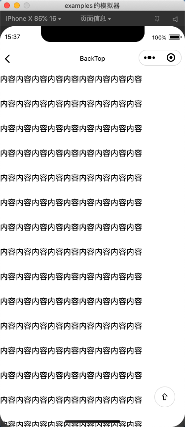

# BackTop -- 返回顶部

## 效果



## 示例

```json
{
  "usingComponents": {
    "me-backtop": "/path/backtop/index"
  }
}
```

```html
<me-backtop>
  <view style="height:1000rpx;">内容内容内容内容内容内容内容内容内容</view>
</me-backtop>
```

## 配置

### Props

| 参数     | 说明                   | 类型   | 默认值 |
| -------- | ---------------------- | ------ | ------ |
| height   | 滚动容器高度           | String | 100vh  |
| right    | 距离页面右侧距离       | String | 40rpx  |
| bottom   | 距离页面底部距离       | String | 80rpx  |
| distance | 页面垂直滚动多高后出现 | Number | 200    |
| zIndex   | 组件页面层级           | Number | 10     |

### Event

| 事件名称 | 说明               | 回调参数          |
| -------- | ------------------ | ----------------- |
| click    | 按钮点击时触发事件 | event: MouseEvent |
