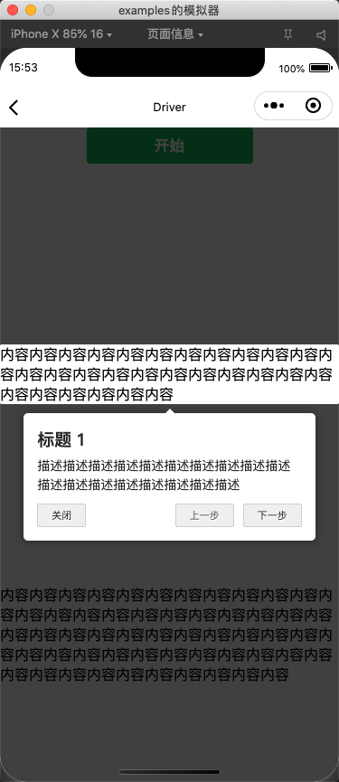
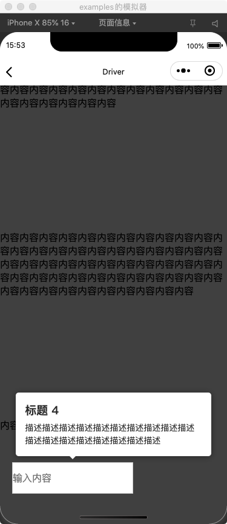

# Driver -- 步骤引导

## 效果




## 示例

```json
{
  "usingComponents": {
    "me-driver": "/path/driver/index",
    "me-driver-item": "/path/driver-item/index"
  }
}
```

```html
<view>
  <button bind:tap="start" type="primary">开始</button>

  <!-- 这个必须的 -->
  <me-driver id="driver"></me-driver>

  <!-- 单个步骤包裹内容 -->
  <me-driver-item id="step-1">
    <view style="margin-top:200px;">
      内容内容内容内容内容内容内容内容内容内容内容内容内容内容内容内容内容内容内容内容内容内容内容内容内容内容内容内容内容
    </view>
  </me-driver-item>

  <!-- 单个步骤包裹内容 -->
  <me-driver-item id="step-2">
    <view style="margin-top:200px;">
      内容内容内容内容内容内容内容内容内容内容内容内容内容内容内容内容内容内容内容内容内容内容内容内容内容内容内容内容内容内容内容内容内容内容内容内容内容内容内容内容内容内容内容内容内容内容内容内容内容内容内容内容内容内容内容内容
    </view>
  </me-driver-item>

  <!-- 单个步骤包裹内容 -->
  <me-driver-item id="step-3">
    <view style="margin-top:200px;">内容内容内容内容内容内容</view>
  </me-driver-item>

  <!-- 单个步骤包裹内容 -->
  <view style="width:200px; margin:50px 20px;">
    <me-driver-item id="step-4">
      <input bind:tap="startInput" style="height:50px; border:1px solid #ccc;" placeholder="输入内容" />
    </me-driver-item>
  </view>
</view>
```

```js
import Driver from '/path/driver/Driver'

Page({
  data: {
    driver: null,
  },

  /**
   * 生命周期函数--监听页面初次渲染完成
   */
  onReady: function () {
    // 创建实例
    this.data.driver = new Driver({
      closeBtnText: '关闭',
      nextBtnText: '下一步',
      prevBtnText: '上一步',
      doneBtnText: '结束',
      showButtons: true,
      onNext(element) {
        console.log('next', element)
      },
      onPrevious(element) {
        console.log('prev', element)
      },
    })
  },

  /**
   * 开始
   */
  start() {
    const driver = this.data.driver

    // 定义步骤
    driver.defineSteps([
      {
        element: '#step-1',
        popover: {
          title: '标题 1',
          description: '描述描述描述描述描述描述描述描述描述描述描述描述描述描述描述描述描述描述',
        },
      },
      {
        element: '#step-2',
        popover: {
          title: '标题 2',
          description: '描述描述描述描述描述描述描述描述描述描述描述描述描述描述描述描述描述描述',
        },
      },
      {
        element: '#step-3',
        popover: {
          title: '标题 3',
          description: '描述描述描述描述描述描述描述描述描述描述描述描述描述描述描述描述描述描述',
        },
      },
    ])

    // 开始执行步骤
    driver.start()
  },
  startInput() {
    const driver = this.data.driver
    // 高亮指定的单个元素
    driver.highlight({
      element: '#step-4',
      popover: {
        title: '标题 4',
        description: '描述描述描述描述描述描述描述描述描述描述描述描述描述描述描述描述描述描述',
        showButtons: false,
        className: 'custom-class',
      },
    })
  },
})
```

## 配置

### Driver 定义

::: tip
以下是默认配置，每一项都可覆盖。
:::

```js
const driver = new Driver({
  selector: '#driver', // 容器组件ID(如果修改默认值，必传)
  animate: true, // 是否开启动画
  opacity: 0.75, // 遮罩层背景透明度
  allowClose: true, // 点击遮罩层是否关闭
  stageBackground: '#ffffff', // 裁剪层背景颜色
  doneBtnText: 'Done', // 结束按钮文字
  closeBtnText: 'Close', // 关闭按钮文字
  nextBtnText: 'Next', // 下一步按钮文字
  prevBtnText: 'Previous', // 上一步按钮文字
  showButtons: false, // 是否显示按钮
  className: '', // 提示层自定义类名
  onReset: (element) => null, // 关闭时事件回调
  onHighlighted: (element) => null, // 当前正在突出显示时事件回调
  onNext: (element) => null, // 点击下一步事件回调
  onPrevious: (element) => null, // 点击上一步事件回调
})
```

### Step 定义

::: tip
单个步骤中的配置将会覆盖实例中的相同配置。
:::

```js
const stepDefinition = {
  element: '#some-item', // 元素的ID(必传)
  stageBackground: '#ffffff', // 裁剪层背景颜色
  popover: { // 如果指定为空，则不显示提示层
    title: 'Title', // 提示层标题
    description: 'Description', // 提示层描述
    showButtons: true, // 是否显示按钮
    doneBtnText: 'Done', // 结束按钮文字
    closeBtnText: 'Close', // 关闭按钮文字
    nextBtnText: 'Next', // 下一步按钮文字
    prevBtnText: 'Previous', // 上一步按钮文字
    position: 'auto', // 提示层定位 auto/top/bottom
    className: '', // 提示层自定义类名
  },
  onNext: (element) => null, // 点击下一步事件回调
  onPrevious: (element) => null, // 点击上一步事件回调
}
```

使用 `highlight` 高亮单个指定的元素。

```js
const driver = new Driver()

driver.highlight(stepDefinition)
```

使用 `defineSteps` 定义一组步骤，然后使用 `start` 执行。

```js
const driver = new Driver()

driver.defineSteps([
  stepDefinition1,
  stepDefinition2,
  stepDefinition3,
  stepDefinition4,
]);

driver.start()
// driver.start(2) // 默认从 0 开始，可以指定开始的索引。
```
